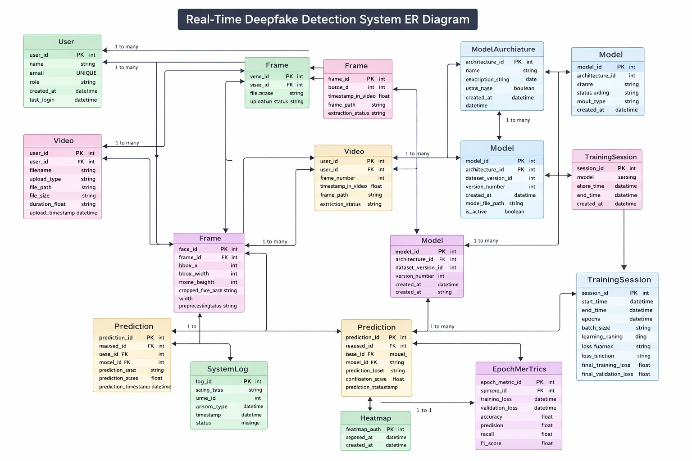

# 🎭 Real-Time Deepfake Detection System

## 📌 Overview

Deepfake technology uses artificial intelligence to manipulate facial expressions and generate highly realistic fake videos. While powerful, this technology poses serious risks including misinformation, identity theft, cybercrime, and political manipulation.

This project presents a Deep Learning–based Deepfake Detection System that classifies videos as:

- ✅ REAL
- ❌ FAKE

The system also provides model explainability using Grad-CAM heatmaps to visualize the regions influencing predictions.

---

# 🏗 System Architecture

## 🔹 High Level Architecture
           ┌────────────────────┐
           │     Input Video     │
           └──────────┬──────────┘
                      ↓
           ┌────────────────────┐
           │  Frame Extraction   │
           └──────────┬──────────┘
                      ↓
           ┌────────────────────┐
           │   Face Detection    │
           └──────────┬──────────┘
                      ↓
           ┌────────────────────┐
           │  Image Preprocessing│
           │ (Resize, Normalize) │
           └──────────┬──────────┘
                      ↓
           ┌────────────────────────────┐
           │  CNN + Frequency Analysis   │
           │  (Spatial + FFT Branch)     │
           └──────────┬──────────────────┘
                      ↓
           ┌────────────────────┐
           │   Classification    │
           │   Real / Fake       │
           └──────────┬──────────┘
                      ↓
           ┌────────────────────┐
           │   Grad-CAM Module   │
           │   Heatmap Output    │
           └────────────────────┘

---

## 🔹 Detailed Pipeline Architecture

### 1. Data Layer
- Deepfake Detection Challenge Dataset
- REAL and FAKE videos
- Metadata-based labeling

### 2. Preprocessing Layer
- Video loading
- Frame extraction (every Nth frame)
- Face cropping
- Resize to 224x224
- Normalization

### 3. Feature Extraction Layer

#### Spatial Branch (CNN)
- Convolution Layers
- Batch Normalization
- ReLU Activation
- Max Pooling
- Fully Connected Layers

#### Frequency Branch
- Fast Fourier Transform (FFT)
- Frequency artifact extraction
- Feature fusion with spatial features

### 4. Classification Layer
- Dense Layer
- Sigmoid Activation
- Binary Output (Real = 0, Fake = 1)

### 5. Explainability Layer
- Grad-CAM
- Heatmap overlay on frames
- Visual focus area highlighting

---

## 📥 Dataset Setup

### Download the Dataset

This project uses the **Deepfake Detection Challenge (DFDC)** dataset from Kaggle.

**Download link:** [https://www.kaggle.com/competitions/deepfake-detection-challenge/data?select=train_sample_videos](https://www.kaggle.com/competitions/deepfake-detection-challenge/data?select=train_sample_videos)

Download the `train_sample_videos` folder. It contains:
- ~400 short `.mp4` video clips (both REAL and FAKE)
- A `metadata.json` file that labels each video as `"REAL"` or `"FAKE"`

> **Note:** The `data/` folder is listed in `.gitignore` and is **not tracked by Git**. You must download and place the dataset manually every time you set up the project on a new machine.

### Where to Place the Dataset

After downloading, place the contents inside the project so the folder structure looks like this:

```
DeepShield/
└── data/
    └── train_sample_videos/
        ├── aapnvogymq.mp4
        ├── abarnvbtwb.mp4
        ├── ...
        └── metadata.json
```

The `data/` directory must sit at the **root of the project** (same level as `preprocessing/`, `model/`, `training/`, etc.).

---

## 🎯 Problem Statement

The rise of deepfake videos has created major security and trust issues across digital platforms. Manual verification is inefficient and unreliable. An automated AI-based detection system is necessary to:

- Detect manipulated facial regions
- Identify frequency inconsistencies
- Provide explainable predictions
- Support real-time inference

---

## 💡 Proposed Solution

This system implements a computer vision pipeline that:

1. Extracts frames from videos
2. Detects faces
3. Preprocesses images
4. Trains a Convolutional Neural Network (CNN)
5. Applies frequency-domain analysis
6. Classifies real vs fake
7. Generates Grad-CAM heatmaps for interpretability

---

## 📂 Project Structure
deepfake-detection-system/
│
├── data/
│ ├── raw/
│ │ ├── real/
│ │ ├── fake/
│ │ └── metadata.json
│ │
│ └── processed/
│ ├── real/
│ └── fake/
│
├── preprocessing/
│ ├── dataset_split.py
│ ├── frame_extractor.py
│ ├── face_detector.py
│ └── augmentations.py
│
├── model/
│ ├── cnn_model.py
│ ├── frequency_branch.py
│ └── loss.py
│
├── training/
│ ├── train.py
│ ├── evaluate.py
│ ├── metrics.py
│ └── early_stopping.py
│
├── inference/
│ ├── predict.py
│ └── realtime_inference.py
│
├── explainability/
│ ├── gradcam.py
│ └── heatmap_utils.py
│
├── notebooks/
│ ├── EDA.ipynb
│ └── FFT_experiments.ipynb
│
├── app.py
├── requirements.txt
└── README.md

---

## 🛠 Tech Stack

### Programming Language
- Python 3.x

### Deep Learning
- PyTorch / TensorFlow

### Computer Vision
- OpenCV
- CNN Architecture
- FFT (Frequency Analysis)

### Data Processing
- NumPy
- Pandas
- Scikit-learn

### Visualization
- Matplotlib
- Seaborn

### Explainability
- Grad-CAM

### Deployment
- Streamlit

---

## 📊 Evaluation Metrics

- Accuracy
- Precision
- Recall
- F1 Score
- Confusion Matrix

---

## 🔥 Key Features

- Binary classification (Real vs Fake)
- Frame-level deepfake detection
- Spatial + Frequency feature fusion
- Model interpretability via Grad-CAM
- Real-time inference capability

---

## 👥 Handoff: Extending Member 1's Work

Member 1 (ML Lead) owns: dataset preprocessing, model architecture, training loop, evaluation, model saving, and Grad-CAM. The following describes how **Member 2** (System + Backend) and **Member 3** (Frontend + Visualization) can build on that work.

---

### Member 2 – System + Backend Engineer

**You integrate the model.** Member 1 provides:

- **Model**: `model/cnn_model.py` (DeepfakeCNN), checkpoint at `saved_models/best_model.pth`
- **Inference helpers**: `inference/predict.py` — `load_model()`, `get_transform()`, `preprocess_image()`, `predict()`, and optionally `predict_with_gradcam()`
- **Realtime loop**: `inference/realtime_inference.py` — frame capture, same preprocessing, model forward, draw label on frame

**What you can extend:**

| Area | Where to start | Notes |
|------|----------------|--------|
| **Model loading** | `inference/predict.load_model(model_path, device)` | Returns `(model, device)`. Use for any backend (FastAPI, script, etc.). |
| **Preprocessing** | `inference/predict.get_transform()` and `preprocess_image(image)` | Must match training: 224×224, ImageNet normalize. Use for every image/frame. |
| **Single-image prediction** | `predict_image(model_path, image_path)` or `predict(model, tensor, device)` | Returns label ("Real"/"Fake") and confidence. Use for upload endpoints. |
| **Grad-CAM** | `predict_with_gradcam(model_path, image_path)` | Returns label, confidence, `heatmap`, and BGR `overlay`. Use for explainability API. |
| **Video / webcam** | `inference/realtime_inference.run_realtime(video_path, model_path, show_gradcam)` | Loop is in `run_realtime`. Extract this into a generator or async frame pipeline for your API. |
| **API (FastAPI)** | New file e.g. `api/main.py` | Endpoints: POST image → JSON `{label, confidence, prob_real}`; optional endpoint that returns overlay image. For video: stream frames or run `run_realtime` logic in a worker/WebSocket. |
| **Optimization** | Same inference code, different wiring | Keep preprocessing identical. Reduce lag by: batching frames, threading (capture vs inference), optional Grad-CAM only on demand, model half-precision if needed. |
| **Confidence** | `predict()` already returns `(label, confidence)` | `confidence` is P(Real) for Real and 1−P(Real) for Fake. Expose as-is or convert to percentage in the API. |

**Suggested structure for your work:**

- `api/` or `backend/`: FastAPI app, routes for `/predict` (image), `/predict_with_gradcam` (image + overlay), and optionally video/streaming.
- Reuse `inference/predict.py` and `inference/realtime_inference.py`; avoid duplicating preprocessing or model loading.

---

### Member 3 – Frontend + Visualization Engineer

**You own UI and demo.** Member 1’s work gives you:

- **Streamlit app**: `app.py` — upload image (with optional Grad-CAM), upload video (first-frame prediction), placeholder for webcam
- **Prediction outputs**: label ("Real"/"Fake"), confidence (0–1), and optionally a Grad-CAM overlay image (BGR numpy or from API)

**What you can extend:**

| Area | Where to start | Notes |
|------|----------------|--------|
| **Upload image** | `app.py` — "Upload image" + `predict_image` / `predict_with_gradcam` | Already shows label and confidence. You can improve layout, add “Real %” / “Fake %” bar, and style the result. |
| **Grad-CAM overlay** | `predict_with_gradcam()` returns `overlay` (BGR image) | Display as a second image or tab. Use `st.image(overlay, channels="BGR")`. Optionally add a toggle or separate “Explain” button. |
| **Upload video** | `app.py` — "Upload video" | Currently runs on first frame only. For full-video UX: either embed a link to run `python -m inference.realtime_inference --video <path>`, or call Member 2’s video/streaming API and render frames in the UI. |
| **Webcam** | Placeholder in `app.py` | Streamlit has no direct webcam API. Options: (1) Use Member 2’s backend: frontend captures webcam, sends frames to API, displays prediction + overlay. (2) Keep “use CLI: realtime_inference” for demo and add a short instruction in the app. |
| **Real/Fake percentage** | Backend already returns `prob_real` and `confidence` | Show e.g. “Real: 73%” and “Fake: 27%” (from `prob_real` and `1 - prob_real`). Use progress bars or a simple gauge. |
| **Heatmap display** | Same `overlay` from Grad-CAM | Overlay is already blended (heatmap on image). You can add a side-by-side: original vs overlay, or a slider to blend. |
| **UI polish** | `app.py` + optional CSS/Streamlit config | Improve titles, spacing, sidebar, error messages, and a short “How to use” for judges. Consider `streamlit run app.py` as the main demo entry. |

**Suggested structure for your work:**

- Keep `app.py` as the main Streamlit entry; refactor into components (e.g. `components/image_upload.py`, `components/video_upload.py`) if the file grows.
- If you add a separate frontend (e.g. React/Vue): talk to Member 2 for API contract (request/response JSON and image formats); use the same labels and confidence/prob_real fields.

---

### Shared conventions (all members)

- **Preprocessing**: Always use `inference/predict.get_transform()` and `preprocess_image()` (or the same resize + normalize) so results match the trained model.
- **Model path**: Default `saved_models/best_model.pth`; make it configurable (env var or CLI) in backend and app.
- **Labels**: `"Real"` / `"Fake"`; confidence in [0, 1]; optional `prob_real` for percentage display.

---

## 🚀 Full Workflow — Step-by-Step Commands

Follow these commands **in order** from the root of the project directory.

---

### Prerequisites

#### 1. System Libraries (macOS — must be done before creating the venv)

Some Python modules require native system libraries that are not installed via `pip`. If these are missing, Python itself will be compiled without support for them and you will see errors like `ModuleNotFoundError: No module named '_lzma'`.

Install them with Homebrew **before** running `pyenv install` or creating the venv:

```bash
brew install xz          # required for Python's _lzma module (used by torchvision)
brew install cmake       # required by some OpenCV build variants
brew install libomp      # optional: OpenMP support for scikit-learn on Apple Silicon
```

> If you already installed Python via pyenv **before** installing `xz`, you must reinstall Python so it compiles with `lzma` support:
> ```bash
> pyenv uninstall 3.12.2
> pyenv install 3.12.2
> ```
> Then recreate the venv (see below).

#### 2. Python Version

This project requires **Python 3.10 or higher**. Recommended: **3.12.x** via pyenv.

```bash
pyenv install 3.12.2
pyenv local 3.12.2
```

#### 3. Virtual Environment

```bash
python3 -m venv venv
source venv/bin/activate     # macOS / Linux
# venv\Scripts\activate      # Windows
```

#### 4. Python Dependencies

```bash
pip install -r requirements.txt
```

---

### Step 1 — Split Videos into REAL / FAKE folders

```bash
python -m preprocessing.dataset_split
```

**What it does:**
Reads `data/train_sample_videos/metadata.json` and moves each video into either `data/raw/real/` or `data/raw/fake/` based on its label. This creates the clean per-class folder structure that all downstream steps rely on.

After this step your `data/` folder will look like:

```
data/
├── train_sample_videos/    ← original download (now partially emptied)
└── raw/
    ├── real/               ← REAL-labeled .mp4 files
    └── fake/               ← FAKE-labeled .mp4 files
```

---

### Step 2 — Extract Frames from Videos

```bash
python -m preprocessing.frame_extractor
```

**What it does:**
Opens every `.mp4` / `.avi` / `.mov` file in `data/raw/real/` and `data/raw/fake/`. For each video it seeks to **30 evenly-spaced frame positions**, decodes only those frames, resizes each one to **224×224 pixels**, and saves them as `.jpg` images in `data/processed/real/` and `data/processed/fake/`. Multiprocessing is used to parallelize across all available CPU cores.

After this step:

```
data/
└── processed/
    ├── real/   ← 224×224 .jpg frames from REAL videos
    └── fake/   ← 224×224 .jpg frames from FAKE videos
```

---

### Step 3 — Prepare Train / Val / Test Splits

```bash
python -m preprocessing.split_train_val_test
```

**What it does:**
Reads the frame images from `data/processed/real/` and `data/processed/fake/` and groups them **by video ID** (all frames from the same source video are kept together). It then assigns each video to one split — **70 % train, 15 % val, 15 % test** — so no frames from the same video leak across splits. Copies are written to the `ImageFolder`-compatible layout that `training/dataset.py` expects:

```
data/processed/
├── train/
│   ├── real/
│   └── fake/
├── val/
│   ├── real/
│   └── fake/
└── test/
    ├── real/
    └── fake/
```

---

### Step 4 — Train the Model

```bash
python -m training.train
```

**What it does:**
Loads the frame images through `DataLoader` (batch size 32, ImageNet normalization). Trains the `DeepfakeCNN` model using **Binary Cross-Entropy with Logits loss** and the **Adam optimizer** (lr = 1e-4) for up to 50 epochs. After every epoch, validation loss and accuracy are printed. The best checkpoint (lowest validation loss) is saved to `saved_models/best_model.pth`. Training stops early if validation loss does not improve for 5 consecutive epochs (early stopping).

Sample output:

```
Epoch 1/50  train_loss=0.6821  val_loss=0.6543  val_acc=0.6120
Epoch 2/50  train_loss=0.5934  val_loss=0.5712  val_acc=0.7040
...
Early stopping at epoch 18
```

---

### Step 5 — Evaluate on the Test Set

```bash
python -m training.evaluate
```

**What it does:**
Loads `saved_models/best_model.pth`, runs it over the held-out test split, and prints Accuracy, Precision, Recall, F1-Score, and the Confusion Matrix. No gradient computation is performed (inference-only).

Sample output:

```
Test set evaluation
----------------------------------------
Accuracy:  0.8750
Precision: 0.8910
Recall:    0.8600
F1:        0.8752

Confusion matrix (rows=true, cols=pred; class 0=fake, 1=real)
             Pred Fake  Pred Real
True Fake      342      48
True Real       31     279
```

---

### Step 6 — Run the Streamlit Demo (Full UI)

```bash
streamlit run app.py
```

**What it does:**
Launches a local web app in your browser. You can:
- Upload an image frame and get a **Real / Fake prediction** with confidence score
- Request a **Grad-CAM heatmap overlay** to see which facial regions drove the decision
- Upload a video and run prediction on the first extracted frame

---

### Quick Reference — All Commands in Order

```bash
# ── System setup (macOS, one-time) ──────────────────────────────────────────
brew install xz cmake libomp        # system libs required before Python compile
pyenv install 3.12.2 && pyenv local 3.12.2

# ── Python environment ───────────────────────────────────────────────────────
python3 -m venv venv
source venv/bin/activate
pip install -r requirements.txt

# ── Data pipeline ────────────────────────────────────────────────────────────
# 1. Sort raw videos into REAL / FAKE folders using metadata.json
python -m preprocessing.dataset_split

# 2. Extract 30 frames per video at 224×224
python -m preprocessing.frame_extractor

# 3. Split frames into train / val / test (70 / 15 / 15, grouped by video)
python -m preprocessing.split_train_val_test

# ── Model ────────────────────────────────────────────────────────────────────
# 4. Train the model
python -m training.train

# 5. Evaluate on test set
python -m training.evaluate

# ── Demo ─────────────────────────────────────────────────────────────────────
# 6. Launch the Streamlit app
streamlit run app.py
```

---

## 🚀 Applications

- Social media content verification
- News authenticity validation
- Cybercrime detection
- Digital identity protection
- Media forensics

---



## 🔮 Future Enhancements

- Transformer-based models
- 3D CNN for temporal modeling
- EfficientNet backbone
- Cloud deployment (AWS/GCP)
- Mobile integration


## 👩‍💻 Author
priyankagnana |aparajita | aditi
AI & Machine Learning Enthusiast  
Computer Vision | Deep Learning | Explainable AI  

## 📜 License

This project is released under the MIT License.